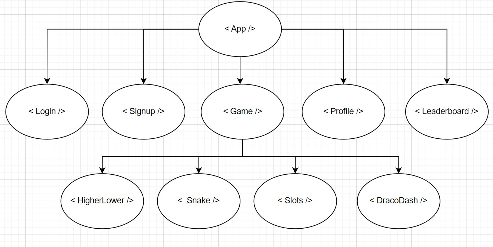

Component tree:

User stories:
- User wants to choose different games to play
- User can compete in a leaderboard ranking
- User can sign in
- User can create an account
- User's score is saved to the account
